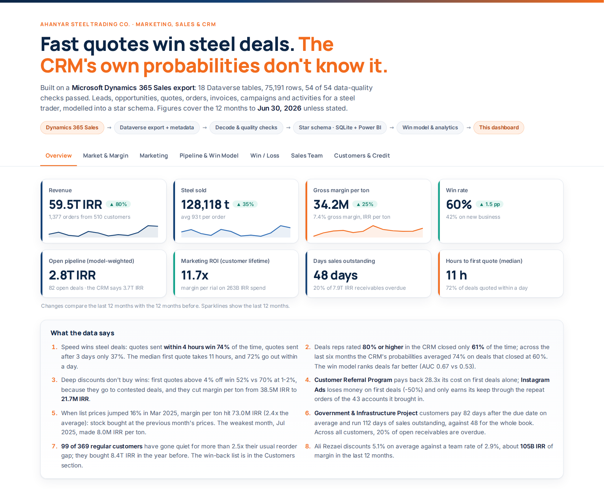
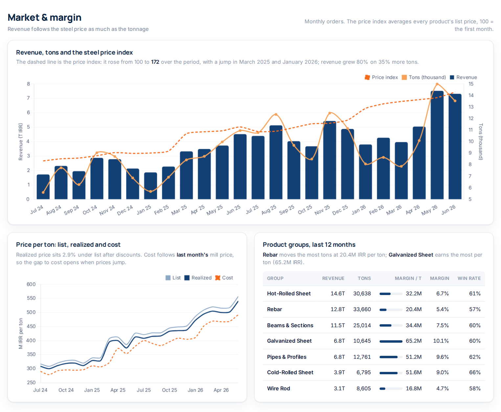
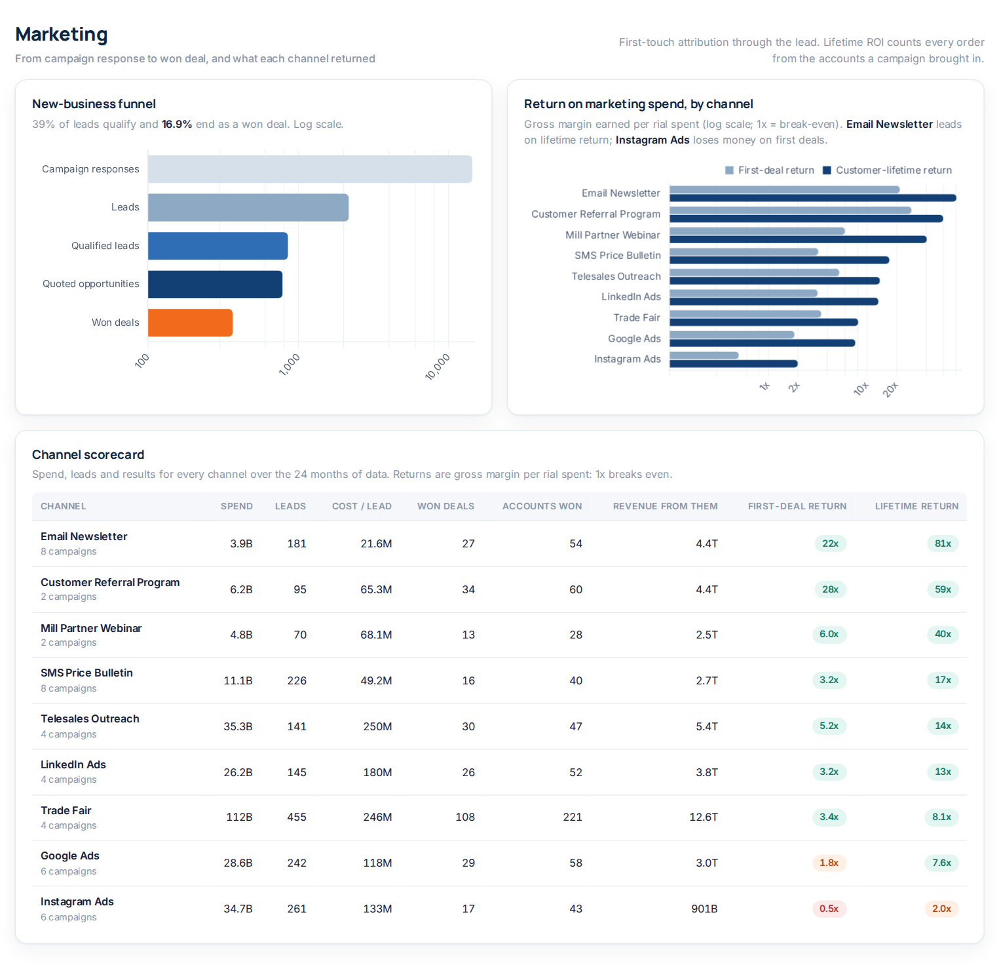
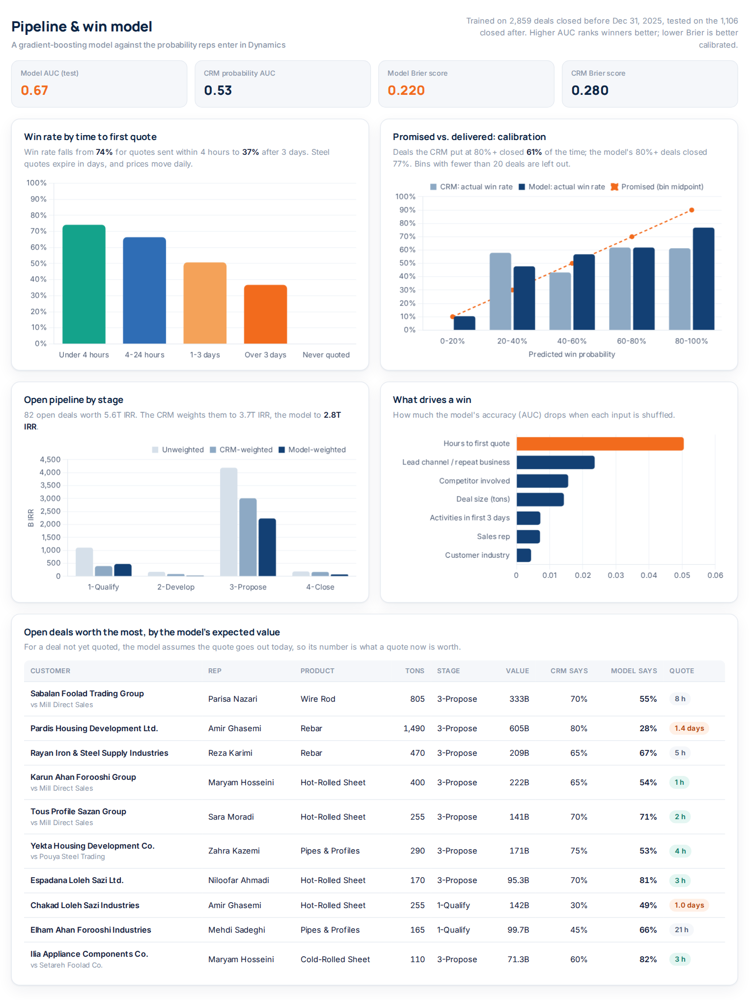
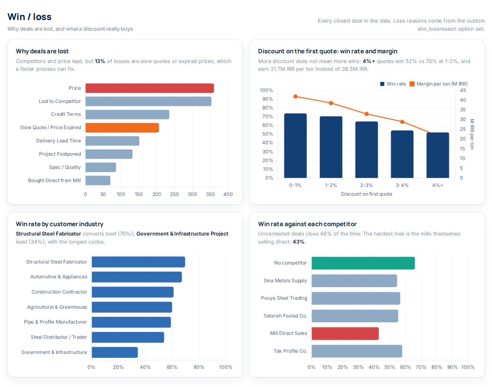
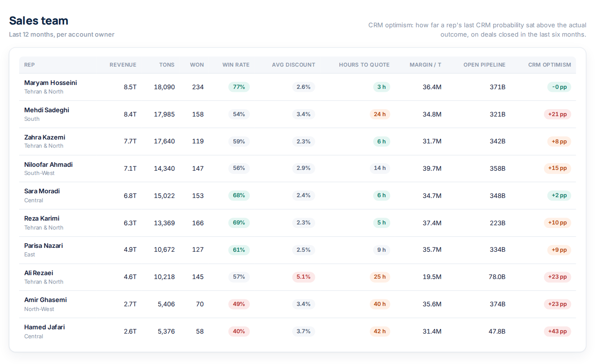
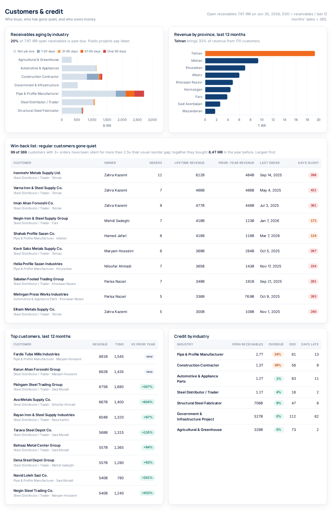
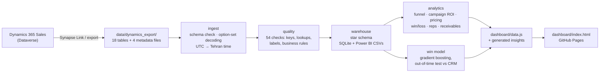

# Steel Sales CRM Intelligence

**Marketing, sales and CRM analytics for a steel trading company, built on a Microsoft Dynamics 365 Sales export.** The pipeline reads the Dataverse tables the way Azure Synapse Link lands them in a data lake (logical column names, integer option-set codes, GUID keys, UTC timestamps and the metadata files that decode them). It runs 54 data-quality checks, models the result as a star schema for SQLite and Power BI, and answers the questions a steel trader's sales director actually asks: which campaigns pay back, why deals are lost, what a discount buys, which open deals will close, who owes money and which regular customers have gone quiet. It includes a win-probability model, which it tests against the close probabilities the reps type into the CRM.

**[Live dashboard](https://milad-shabani.github.io/Steel-sales-crm-intelligence/)** · [Dashboard source](dashboard/index.html)

[](https://github.com/Milad-Shabani/Steel-sales-crm-intelligence/actions/workflows/ci.yml)


> ⚠️ **All data is synthetic.** "Ahanyar Steel Trading Co.", its customers, reps and competitors are fictional. The export is generated to behave like a real one; see [Data provenance](#data-provenance).

---

## The business problem

A steel trader buys rebar, beams, sheet, pipe and wire rod from the mills and sells it on to contractors, fabricators, manufacturers, distributors and public projects. Margins are thin (5-11% of revenue), prices move every week, a quote is good for about three days, and much of the market buys on credit. The CRM holds everything needed to run this better, but the numbers sales reviews rely on come from the reps: the close probability they enter on each deal. Across the last six months of deals, those probabilities averaged 74% on deals that actually closed at 60%.

This project turns the Dynamics 365 export into answers:

- **Marketing:** what each channel returned. The first-deal return and the customer-lifetime return tell very different stories.
- **Sales:** how quote speed, discount, competitors and deal size move the win rate, and why deals are lost.
- **Forecasting:** a win-probability model that scores the open pipeline better than the CRM's own numbers.
- **Pricing:** price realization against list, and margin per ton when the steel price jumps or falls.
- **Customers and credit:** receivables aging and DSO by industry, top customers, and a win-back list of regular customers who have gone quiet by their own standards.

## Results at a glance

Last 12 months to 30 June 2026 unless stated.

| Metric | Value |
|---|---:|
| Revenue / steel sold | **59.5T IRR** / **128,118 t** (1,377 orders, 510 customers) |
| Gross margin | **34.2M IRR per ton** (7.4% of revenue) |
| Win rate | **60%** overall, 42% on new business |
| Win rate by time to first quote | **74%** under 4 hours → **37%** after 3 days |
| Win model vs the CRM's own probability (1,106 deals closed Jan-Jun 2026) | AUC **0.67 vs 0.53**, Brier 0.220 vs 0.280 |
| Deals the CRM rated 80%+ that actually closed | **61%** (the model's 80%+ deals: 77%) |
| Open pipeline, weighted | 3.7T IRR by the CRM vs **2.8T IRR** by the model |
| Marketing | 263B IRR spend over 24 months; returns range from **0.5x** (Instagram, first deals) to **28x** (referral program) |
| Receivables | 7.9T IRR open, **48 days DSO**, 20% overdue |
| Data quality | 18 Dataverse tables, 75,191 rows, **54 of 54 checks passed** |

## Dashboard

A static, self-contained page ([`dashboard/index.html`](dashboard/index.html), Chart.js, white theme) with seven sections, published to GitHub Pages on every push to `main`. The headline sentences are computed from the data, so they stay true when the export changes.

**Overview: eight KPIs with 12-month trends, and what the data says**



**Market and margin: revenue, tons and the steel price index; list vs. realized vs. cost per ton; product groups**



**Marketing: the new-business funnel and first-deal vs. customer-lifetime return by channel**



**Pipeline and win model: quote speed, calibration against the CRM, drivers, and the open deals worth the most**



**Win / loss: loss reasons, what a discount buys, industries and competitors**



**Sales team and customers & credit**




## How it works



| Step | Module | What it does |
|---|---|---|
| Export | [`datagen/`](src/steel_crm/datagen) | Simulates the commercial cycle and writes a Dataverse export: campaigns → responses → leads → accounts and opportunities → quotes → sales orders → invoices and payments, plus activities and weekly pipeline snapshots |
| Ingest | [`ingest/dataverse.py`](src/steel_crm/ingest/dataverse.py) | Checks every table has the columns the pipeline needs, adds a `<column>_label` for every option set, state and status, and converts UTC timestamps to Tehran time |
| Quality | [`quality/checks.py`](src/steel_crm/quality/checks.py) | Unique keys, 29 lookup (foreign key) checks, codes without a label, and sales-process rules (a won deal has a value, a close date and an order; a qualified lead points at its opportunity; order lines add up). Errors stop the run |
| Warehouse | [`warehouse/star_schema.py`](src/steel_crm/warehouse/star_schema.py) | Dimensions (date, account, product, rep, campaign) and facts (leads, opportunities with model features, order lines with cost and margin, invoices with days late, responses, activities, pipeline snapshots), written to SQLite and to CSV for Power BI |
| Analytics | [`analytics/`](src/steel_crm/analytics) | Funnel and first-touch campaign ROI; KPIs, pricing and margin, win/loss, reps and provinces; receivables aging, DSO, top customers and the win-back list; the insight sentences |
| Model | [`models/win_probability.py`](src/steel_crm/models/win_probability.py) | Histogram gradient boosting on features known early in a deal; trained on deals closed before 2026, tested on the 1,106 closed after, compared with the reps' probabilities on the same deals, then refit to score the open pipeline |
| Report | [`reporting/dashboard_data.py`](src/steel_crm/reporting/dashboard_data.py) | Writes `dashboard/data.js` for the static dashboard |

## The Dataverse export

`data/dynamics_export/` holds one CSV per table, named and columned like Dataverse (`opportunity.estimatedvalue`, `lead.leadsourcecode`, `quote.effectiveto`, ...):

| Area | Tables |
|---|---|
| Marketing | `campaign`, `campaignresponse`, `lead` |
| Sales | `account`, `opportunity`, `opportunitycompetitors`, `competitor`, `quote`, `salesorder`, `salesorderdetail`, `invoice` |
| Catalog and pricing | `product`, `pricelevel`, `productpricelevel`, `uom`, `transactioncurrency` |
| People and activity | `systemuser`, `territory`, `activitypointer` |
| Custom | `ahn_pipelinesnapshot`: a weekly snapshot of open deals, as a scheduled Power Automate flow would keep one |
| Metadata | `OptionsetMetadata`, `GlobalOptionsetMetadata`, `StateMetadata`, `StatusMetadata` |

Standard option sets keep their Dynamics codes (lead source 7 = Trade Show, opportunity status 5 = Out-Sold, forecast category 100000003 = Committed, ...). Custom columns carry the publisher prefix `ahn_`: `ahn_productgroup` (a global option set), `ahn_lossreason`, `ahn_channel`, `ahn_tonnage`, `ahn_costperton`, `ahn_paidon`. Unlike Synapse Link, which keeps the schema in `model.json`, each CSV here has a header row. Column-level notes are in [`docs/DATA_DICTIONARY.md`](docs/DATA_DICTIONARY.md).

### Using a real Dynamics 365 export

1. Export the tables above with Azure Synapse Link for Dataverse (or Power Automate / the Web API) into CSV, with a header row, one file per table named by its logical name, and the four metadata files.
2. Custom columns: map your own loss-reason, channel, tonnage and cost fields to the `ahn_` names, or change `SCHEMA` in `ingest/dataverse.py`.
3. `python -m steel_crm.cli run --export path/to/export`. A missing column stops the run with the table and column named; data-quality errors stop it with the failing checks listed in `data/processed/data_quality_report.csv`.

## Findings worth acting on

- **Quote within hours.** Win rate falls from 74% (under 4 hours) to 66%, 51% and 37% (over 3 days); deals never quoted are all lost. Hours to first quote is the model's strongest driver by a wide margin, and 13% of losses are recorded as "Slow Quote / Price Expired".
- **Don't trust the CRM's probability for forecasting.** The reps' last probability before close hardly ranks winners (AUC 0.53) and is optimistic at the top: 80%+ deals close 61% of the time. The model ranks better (0.67) and weights the open pipeline at 2.8T IRR where the CRM says 3.7T.
- **Discounts go to the hard deals and don't win them.** First quotes over 4% off win 52%, vs 70% at 1-2%, and earn 21.7M IRR per ton instead of 38.5M. One rep discounts 5.1% on average against a team rate of 2.9%, worth about 105B IRR of margin a year.
- **Judge channels on customer lifetime, not the first deal.** Instagram ads lose half their cost on first deals (0.5x) but reach 2.0x over the customers' lifetime. The referral program and email price newsletter return 28x and 22x on first deals alone.
- **Margin per ton rides the price index.** Stock is bought at last month's mill price, so the March 2025 price jump (+16%) lifted margin per ton to 73M IRR, 2.4x the average, and the July 2025 correction cut it to 8M.
- **Credit risk sits with public projects.** They pay 82 days late on average and run 112 days of sales outstanding, against 48 for the whole book.
- **99 of 369 regular customers have gone quiet**, meaning they've been silent for more than 2.5 times their own usual reorder gap. They bought 8.4T IRR in the prior year, and the dashboard lists them with their owners.

Methodology, including the attribution rules, the model's features and evaluation, and the definitions of DSO and "gone quiet", is in [`docs/METHODOLOGY.md`](docs/METHODOLOGY.md).

## Quickstart

```bash
git clone https://github.com/Milad-Shabani/Steel-sales-crm-intelligence.git
cd Steel-sales-crm-intelligence
pip install -r requirements.txt && pip install -e .

python -m steel_crm.cli run              # checks, star schema, model, dashboard/data.js
open dashboard/index.html                # or any browser; no server needed

python -m steel_crm.cli generate-data --seed 7   # a different synthetic export
pytest                                           # 17 tests
```

Outputs land in `data/processed/`: `steel_crm.db` (SQLite star schema), `powerbi/*.csv` (the same tables for Power BI), `data_quality_report.csv` and `model_metrics.json`.

## Project structure

```
├── data/dynamics_export/      # the Dataverse export (committed; regenerate with generate-data)
├── data/processed/            # SQLite, Power BI CSVs, DQ report, model metrics (generated)
├── dashboard/                 # index.html, data.js (generated), chart.umd.min.js
├── docs/                      # data dictionary, methodology, screenshots
├── src/steel_crm/
│   ├── datagen/               # business catalog + Dataverse export generator
│   ├── ingest/                # load, schema check, option-set decoding, time zones
│   ├── quality/               # data-quality checks
│   ├── warehouse/             # star schema, SQLite + CSV writer
│   ├── analytics/             # marketing, sales, accounts & credit, insights
│   ├── models/                # win-probability model
│   ├── reporting/             # dashboard data writer
│   ├── pipeline.py            # end-to-end run
│   └── cli.py                 # generate-data / run
└── tests/                     # generator, ingest, quality, analytics, model, pipeline
```

## Data provenance

Every row is generated by [`src/steel_crm/datagen/generator.py`](src/steel_crm/datagen/generator.py) from the profiles in [`catalog.py`](src/steel_crm/datagen/catalog.py): 23 products in 7 groups priced from a monthly steel price index with the shocks a trader would recognise; 7 customer industries with their own product mix, deal size, price sensitivity, payment terms and payment habits; 9 marketing channels over 44 campaigns; 10 reps with their own quote speed, discounting, skill and optimism; 5 competitors including the mills selling direct. Company, person and competitor names are invented. Any resemblance to a real company is a coincidence.

## License

MIT. See [LICENSE](LICENSE).
