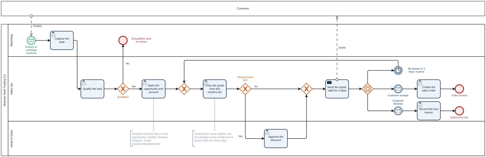
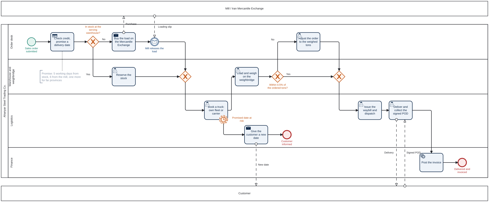
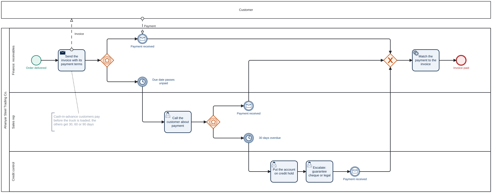
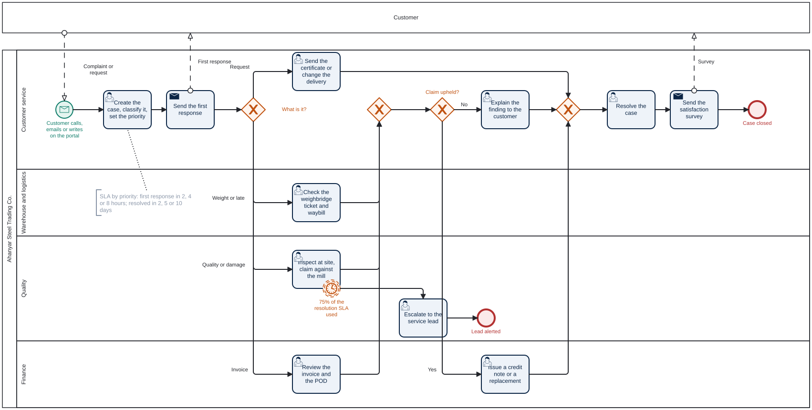
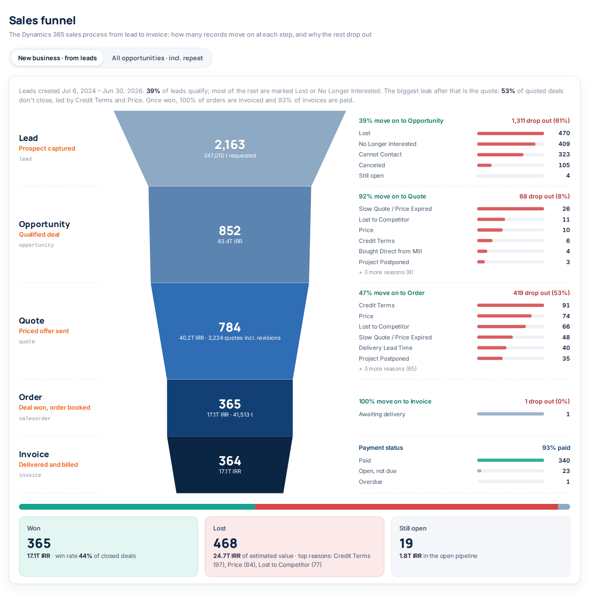
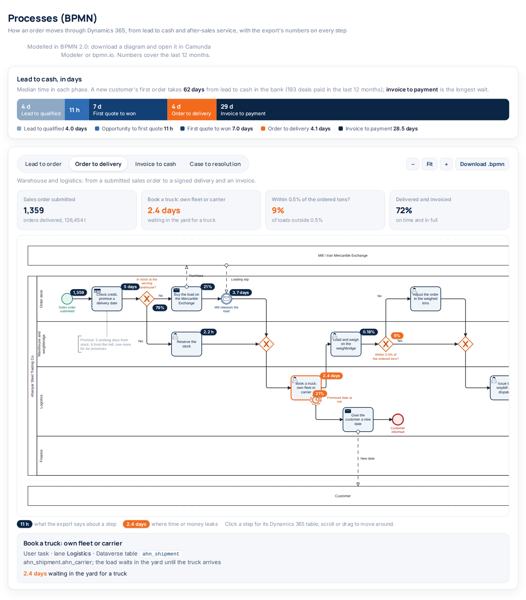
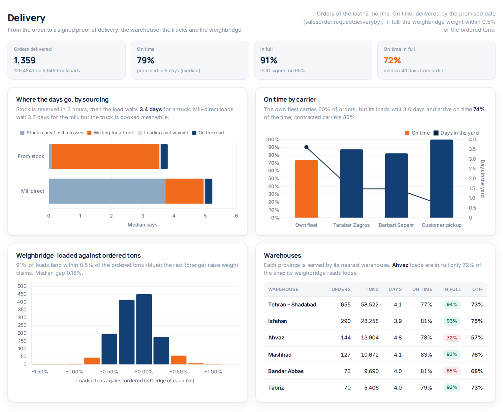
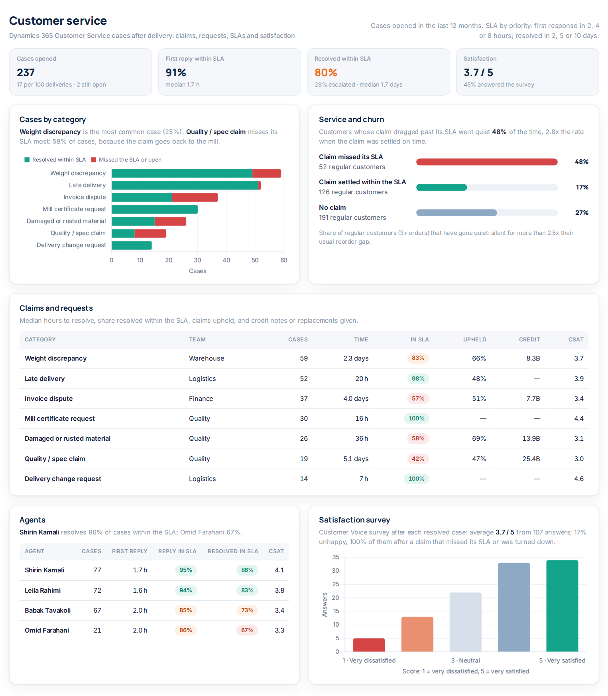
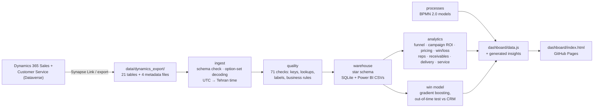

# Steel Sales CRM Intelligence

**Marketing, sales, CRM and operations analytics for a steel trading company, built on a Microsoft Dynamics 365 export (Sales, Customer Service and a custom shipment table).** The pipeline reads the Dataverse tables the way Azure Synapse Link lands them in a data lake (logical column names, integer option-set codes, GUID keys, UTC timestamps and the metadata files that decode them). It runs 71 data-quality checks, models the result as a star schema for SQLite and Power BI, and answers the questions a steel trader's management actually asks: which campaigns pay back, why deals are lost, what a discount buys, which open deals will close, why deliveries run late, who owes money, which claims drive customers away and which regular customers have gone quiet. It includes a win-probability model, which it tests against the close probabilities the reps type into the CRM. The company's lead-to-cash processes are modelled in **BPMN 2.0**, with the export's numbers on every step.

**[Live dashboard](https://milad-shabani.github.io/Steel-sales-crm-intelligence/)** · [Dashboard source](dashboard/index.html)

[](https://github.com/Milad-Shabani/Steel-sales-crm-intelligence/actions/workflows/ci.yml)


> ⚠️ **All data is synthetic.** "Ahanyar Steel Trading Co.", its customers, reps and competitors are fictional. The export is generated to behave like a real one; see [Data provenance](#data-provenance).

---

## The business problem

A steel trader buys rebar, beams, sheet, pipe and wire rod from the mills and sells it on to contractors, fabricators, manufacturers, distributors and public projects. Margins are thin (5-11% of revenue), prices move every week, a quote is good for about three days, and much of the market buys on credit. The CRM holds everything needed to run this better, but the numbers sales reviews rely on come from the reps: the close probability they enter on each deal. Across the last six months of deals, those probabilities averaged 74% on deals that actually closed at 60%.

This project turns the Dynamics 365 export into answers:

- **The sales funnel:** Lead → Opportunity → Quote → Order → Invoice → Won / Lost, the way Dynamics 365 records it, with how many deals drop out at each step and why.
- **Marketing:** what each channel returned. The first-deal return and the customer-lifetime return tell very different stories.
- **Sales:** how quote speed, discount, competitors and deal size move the win rate, and why deals are lost.
- **Forecasting:** a win-probability model that scores the open pipeline better than the CRM's own numbers.
- **Pricing:** price realization against list, and margin per ton when the steel price jumps or falls.
- **Customers and credit:** receivables aging and DSO by industry, top customers, and a win-back list of regular customers who have gone quiet by their own standards.
- **Processes:** lead to order, order to delivery, invoice to cash and case to resolution, drawn in BPMN 2.0 and measured from the export.
- **Delivery:** on time, in full, and where the days between order and delivery go: stock, the mill, the yard, the road.
- **Customer service:** claims and requests by category, SLAs, credit notes, satisfaction, and what a late claim does to a customer.

## Results at a glance

Last 12 months to 30 June 2026 unless stated.

| Metric | Value |
|---|---:|
| Revenue / steel sold | **59.5T IRR** / **128,118 t** (1,377 orders, 510 customers) |
| Gross margin | **34.2M IRR per ton** (7.4% of revenue) |
| Sales funnel, new business (24 months) | 2,163 leads → 852 opportunities → 784 quoted → 365 orders → 364 invoices (93% paid) |
| Win rate | **60%** overall, 42% on new business |
| Win rate by time to first quote | **74%** under 4 hours → **37%** after 3 days |
| Win model vs the CRM's own probability (1,106 deals closed Jan-Jun 2026) | AUC **0.67 vs 0.53**, Brier 0.220 vs 0.280 |
| Deals the CRM rated 80%+ that actually closed | **61%** (the model's 80%+ deals: 77%) |
| Open pipeline, weighted | 3.7T IRR by the CRM vs **2.8T IRR** by the model |
| Marketing | 263B IRR spend over 24 months; returns range from **0.5x** (Instagram, first deals) to **28x** (referral program) |
| Receivables | 7.9T IRR open, **48 days DSO**, 20% overdue |
| Lead to cash, new customers | **62 days** median from lead to payment: 4 days to qualify, 11 h to the first quote, 7 days to win, 4 days to deliver, 29 days to pay |
| Delivery (1,359 orders) | **72% on time in full**: 79% on time, 91% within 0.5% of the ordered tons; loads wait **2.4 days** in the yard for a truck |
| Customer service (237 cases) | 17 cases per 100 deliveries; 91% first replies and **80% resolutions within SLA**; satisfaction 3.7 / 5 |
| Data quality | 21 Dataverse tables, 78,355 rows, **70 of 71 checks passed**, 1 warning (99 deliveries without a signed proof of delivery) |

## Business processes in BPMN

Four processes carry an order from the first enquiry to cash and after-sales service. Each is a BPMN 2.0 collaboration: Ahanyar's pool split into lanes by team, black-box pools for the customer and the mill, message flows between them. Every step names the Dataverse table it reads or writes, so the diagrams and the export describe the same process, and the dashboard puts the measured numbers on each step (hover or click a step there). The `.bpmn` files open in [Camunda Modeler](https://camunda.com/download/modeler/) or [bpmn.io](https://demo.bpmn.io/); the diagrams below are rendered from them with bpmn-js.

**1. Lead to order** · Dynamics 365 Sales · [`lead_to_order.bpmn`](docs/bpmn/lead_to_order.bpmn)

Marketing captures the lead, the rep qualifies it and opens the opportunity (business process flow Qualify → Develop → Propose → Close), prices the quote from this month's list, and the head of sales signs off discounts over 3%. The quote holds for three days; with no answer by then it is re-priced.



**2. Order to delivery** · warehouse and logistics, custom table `ahn_shipment` · [`order_to_delivery.bpmn`](docs/bpmn/order_to_delivery.bpmn)

A credit check and a promised date, then stock at the warehouse that serves the customer's province or a mill-direct purchase on the Iran Mercantile Exchange; a truck from the own fleet or a carrier; the weighbridge (outside 0.5% of the ordered tons, the order is adjusted); the waybill and the signed proof of delivery; the invoice. A timer on the truck booking warns when the promised date is at risk.



**3. Invoice to cash** · finance · [`invoice_to_cash.bpmn`](docs/bpmn/invoice_to_cash.bpmn)

The invoice goes out with the account's payment terms. Past the due date the rep calls the customer; at 30 days overdue credit control puts the account on hold and escalates.



**4. Case to resolution** · Dynamics 365 Customer Service · [`case_to_resolution.bpmn`](docs/bpmn/case_to_resolution.bpmn)

The agent opens the case, sets its priority (and so its SLA) and replies; the team that owns the problem investigates: warehouse and logistics for weight and late-delivery claims, quality for spec and damage claims (with an escalation when 75% of the SLA is used), finance for invoice disputes. An upheld claim gets a credit note or a replacement; every resolved case gets a satisfaction survey.



| Process | Steps measured from the export (last 12 months) |
|---|---|
| Lead to order | 1,016 leads, 39% qualified in 4 days · 11 h to the first quote · 33% of first quotes over 3% (manager approval) · 64% of quoted deals won · top loss reason: price |
| Order to delivery | 79% from stock (ready in 2 h), 21% mill-direct (3.7 days) · **2.4 days waiting for a truck** · 9% of loads outside the weighbridge tolerance · 5.5 h on the road · 72% on time in full |
| Invoice to cash | 1,373 invoices · 55% paid by the due date · 28.5 days to payment · 5% more than 30 days late · DSO 48 days |
| Case to resolution | 237 cases · 91% first replies within SLA · quality and damage claims take 2.8 days · 57% of claims upheld, 55.3B IRR in credit notes · 80% resolved within SLA · satisfaction 3.7 / 5 |

## Dashboard

A static, self-contained page ([`dashboard/index.html`](dashboard/index.html), Chart.js and the bpmn-js viewer, white theme) with eleven sections, published to GitHub Pages on every push to `main`. The headline sentences are computed from the data, so they stay true when the export changes. Chart.js (MIT) and the bpmn-js viewer ([bpmn.io license](https://bpmn.io/license/)) are bundled, so the page works offline.

**Overview: twelve KPIs with 12-month trends, and what the data says**


**Sales funnel: the Dynamics 365 process from lead to invoice, with where and why deals drop out (new business or all opportunities)**



**Processes: lead to cash in days, and the four BPMN diagrams with the export's numbers on each step**



**Market and margin: revenue, tons and the steel price index; list vs. realized vs. cost per ton; product groups**


**Marketing: lead quality by source and first-deal vs. customer-lifetime return by channel**


**Pipeline and win model: quote speed, calibration against the CRM, drivers, and the open deals worth the most**


**Win / loss: loss reasons, what a discount buys, industries and competitors**


**Sales team**


**Delivery: where the days go, carriers, the weighbridge and the warehouses**



**Customers and credit**


**Customer service: cases by category and SLA, service and churn, claims, agents and satisfaction**



## How it works



| Step | Module | What it does |
|---|---|---|
| Export | [`datagen/`](src/steel_crm/datagen) | Simulates the commercial cycle and writes a Dataverse export: campaigns → responses → leads → accounts and opportunities → quotes → sales orders → shipments → invoices and payments → service cases, plus activities and weekly pipeline snapshots |
| Ingest | [`ingest/dataverse.py`](src/steel_crm/ingest/dataverse.py) | Checks every table has the columns the pipeline needs, adds a `<column>_label` for every option set, state and status, and converts UTC timestamps to Tehran time |
| Quality | [`quality/checks.py`](src/steel_crm/quality/checks.py) | Unique keys, 36 lookup (foreign key) checks, codes without a label, and process rules (a won deal has a value, a close date and an order; a qualified lead points at its opportunity; order lines add up; every order has one shipment whose steps run in order; a delivered load was weighed and signed for; a resolved case has its resolution). Errors stop the run |
| Warehouse | [`warehouse/star_schema.py`](src/steel_crm/warehouse/star_schema.py) | Dimensions (date, account, product, user, campaign) and facts (leads, opportunities with model features, order lines with cost and margin, shipments with each step's time, on time and in full, invoices with days late, service cases with their SLAs, responses, activities, pipeline snapshots), written to SQLite and to CSV for Power BI |
| Analytics | [`analytics/`](src/steel_crm/analytics) | The Dynamics 365 sales funnel with drop-out reasons; lead quality and first-touch campaign ROI; KPIs, pricing and margin, win/loss, reps and provinces; receivables aging, DSO, top customers and the win-back list; delivery (on time in full, phases, carriers, weighbridge), collections and customer service (SLAs, claims, satisfaction, service and churn); the numbers on each BPMN step; the insight sentences |
| Processes | [`processes/`](src/steel_crm/processes) | The four processes as a small BPMN model (pools, lanes, events, tasks, gateways, flows on a grid), written as BPMN 2.0 XML with diagram interchange; `python -m steel_crm.cli bpmn` writes [`docs/bpmn/`](docs/bpmn) and [`scripts/render_bpmn.js`](scripts/render_bpmn.js) renders the SVGs |
| Model | [`models/win_probability.py`](src/steel_crm/models/win_probability.py) | Histogram gradient boosting on features known early in a deal; trained on deals closed before 2026, tested on the 1,106 closed after, compared with the reps' probabilities on the same deals, then refit to score the open pipeline |
| Report | [`reporting/dashboard_data.py`](src/steel_crm/reporting/dashboard_data.py) | Writes `dashboard/data.js` for the static dashboard |

## The Dataverse export

`data/dynamics_export/` holds one CSV per table, named and columned like Dataverse (`opportunity.estimatedvalue`, `lead.leadsourcecode`, `quote.effectiveto`, ...):

| Area | Tables |
|---|---|
| Marketing | `campaign`, `campaignresponse`, `lead` |
| Sales | `account`, `opportunity`, `opportunitycompetitors`, `competitor`, `quote`, `salesorder`, `salesorderdetail`, `invoice` |
| Customer Service | `incident` (cases with their SLA, escalation, claim outcome and satisfaction), `incidentresolution` |
| Catalog and pricing | `product`, `pricelevel`, `productpricelevel`, `uom`, `transactioncurrency` |
| People and activity | `systemuser`, `territory`, `activitypointer` |
| Custom | `ahn_pipelinesnapshot`: a weekly snapshot of open deals, as a scheduled Power Automate flow would keep one. `ahn_shipment`: one row per order from the warehouse and weighbridge (warehouse, stock or mill-direct, carrier, ordered and weighed tons, ready, loaded, dispatched and delivered times, proof of delivery) |
| Metadata | `OptionsetMetadata`, `GlobalOptionsetMetadata`, `StateMetadata`, `StatusMetadata` |

Standard option sets keep their Dynamics codes (lead source 7 = Trade Show, opportunity status 5 = Out-Sold, forecast category 100000003 = Committed, ...). Custom columns carry the publisher prefix `ahn_`: `ahn_productgroup` (a global option set), `ahn_lossreason`, `ahn_channel`, `ahn_tonnage`, `ahn_costperton`, `ahn_paidon`, `ahn_casecategory`, `ahn_claimupheld`. Unlike Synapse Link, which keeps the schema in `model.json`, each CSV here has a header row. Column-level notes are in [`docs/DATA_DICTIONARY.md`](docs/DATA_DICTIONARY.md).

### Using a real Dynamics 365 export

1. Export the tables above with Azure Synapse Link for Dataverse (or Power Automate / the Web API) into CSV, with a header row, one file per table named by its logical name, and the four metadata files.
2. Custom columns: map your own loss-reason, channel, tonnage, cost and shipment fields to the `ahn_` names, or change `SCHEMA` in `ingest/dataverse.py`. If deliveries live in Dynamics 365 Supply Chain Management, dual-write or a flow can fill `ahn_shipment`.
3. `python -m steel_crm.cli run --export path/to/export`. A missing column stops the run with the table and column named; data-quality errors stop it with the failing checks listed in `data/processed/data_quality_report.csv`.

## Findings worth acting on

- **The funnel leaks at two places.** 61% of new leads never qualify (mostly marked Lost or No Longer Interested), and 53% of quoted new-business deals are lost, most often over credit terms, price and competitors. Once a deal is won, delivery and billing hold up: all but one order is invoiced and 93% of invoices are paid.
- **Quote within hours.** Win rate falls from 74% (under 4 hours) to 66%, 51% and 37% (over 3 days); deals never quoted are all lost. Hours to first quote is the model's strongest driver by a wide margin, and 13% of losses are recorded as "Slow Quote / Price Expired".
- **Don't trust the CRM's probability for forecasting.** The reps' last probability before close hardly ranks winners (AUC 0.53) and is optimistic at the top: 80%+ deals close 61% of the time. The model ranks better (0.67) and weights the open pipeline at 2.8T IRR where the CRM says 3.7T.
- **Discounts go to the hard deals and don't win them.** First quotes over 4% off win 52%, vs 70% at 1-2%, and earn 21.7M IRR per ton instead of 38.5M. One rep discounts 5.1% on average against a team rate of 2.9%, worth about 105B IRR of margin a year.
- **Judge channels on customer lifetime, not the first deal.** Instagram ads lose half their cost on first deals (0.5x) but reach 2.0x over the customers' lifetime. The referral program and email price newsletter return 28x and 22x on first deals alone.
- **Margin per ton rides the price index.** Stock is bought at last month's mill price, so the March 2025 price jump (+16%) lifted margin per ton to 73M IRR, 2.4x the average, and the July 2025 correction cut it to 8M.
- **Credit risk sits with public projects.** They pay 82 days late on average and run 112 days of sales outstanding, against 48 for the whole book.
- **99 of 369 regular customers have gone quiet**, meaning they've been silent for more than 2.5 times their own usual reorder gap. They bought 8.4T IRR in the prior year, and the dashboard lists them with their owners.
- **Trucks, not steel, hold up deliveries.** Stock is reserved in about 2 hours, then the load waits a median 2.4 days in the yard. The own fleet carries 60% of orders; its loads wait 3.6 days and arrive on time 74% of the time, against 85% with contracted carriers. Booking a carrier when the fleet is full is the cheapest fix for on-time delivery.
- **One weighbridge causes the weight claims.** Ahvaz puts 28% of loads outside the 0.5% tolerance, against 7% at the other warehouses, and weight discrepancies are the most common service case (25%).
- **Late claims cost customers.** Regular customers whose claim missed its resolution SLA went quiet 48% of the time; when the claim was settled within the SLA, 17%. Quality and damage claims, which go back to the mill, miss their SLA most often, and every unhappy survey answer followed a claim that was late or turned down.

Methodology, including the attribution rules, the model's features and evaluation, and the definitions of DSO and "gone quiet", is in [`docs/METHODOLOGY.md`](docs/METHODOLOGY.md).

## Quickstart

```bash
git clone https://github.com/Milad-Shabani/Steel-sales-crm-intelligence.git
cd Steel-sales-crm-intelligence
pip install -r requirements.txt && pip install -e .

python -m steel_crm.cli run              # checks, star schema, model, dashboard/data.js
open dashboard/index.html                # or any browser; no server needed

python -m steel_crm.cli bpmn             # docs/bpmn/*.bpmn (open in Camunda Modeler or bpmn.io)
node scripts/render_bpmn.js              # optional: the SVGs, needs Playwright

python -m steel_crm.cli generate-data --seed 7   # a different synthetic export
pytest                                           # 32 tests
```

Outputs land in `data/processed/`: `steel_crm.db` (SQLite star schema), `powerbi/*.csv` (the same tables for Power BI), `data_quality_report.csv` and `model_metrics.json`.

## Project structure

```
├── data/dynamics_export/      # the Dataverse export (committed; regenerate with generate-data)
├── data/processed/            # SQLite, Power BI CSVs, DQ report, model metrics (generated)
├── dashboard/                 # index.html, data.js (generated), Chart.js, the bpmn-js viewer
├── docs/                      # data dictionary, methodology, screenshots
│   └── bpmn/                  # the four processes: .bpmn (BPMN 2.0) and .svg
├── src/steel_crm/
│   ├── datagen/               # business catalog + Dataverse export generator
│   ├── ingest/                # load, schema check, option-set decoding, time zones
│   ├── quality/               # data-quality checks
│   ├── warehouse/             # star schema, SQLite + CSV writer
│   ├── analytics/             # funnel, marketing, sales, accounts & credit, operations, insights
│   ├── processes/             # BPMN model, the four process definitions, XML writer
│   ├── models/                # win-probability model
│   ├── reporting/             # dashboard data writer
│   ├── pipeline.py            # end-to-end run
│   └── cli.py                 # generate-data / run / bpmn
├── scripts/render_bpmn.js     # renders docs/bpmn/*.svg with bpmn-js
└── tests/                     # generator, ingest, quality, analytics, operations, processes, model, pipeline
```

## Data provenance

Every row is generated by [`src/steel_crm/datagen/generator.py`](src/steel_crm/datagen/generator.py) from the profiles in [`catalog.py`](src/steel_crm/datagen/catalog.py): 23 products in 7 groups priced from a monthly steel price index with the shocks a trader would recognise; 7 customer industries with their own product mix, deal size, price sensitivity, payment terms and payment habits; 9 marketing channels over 44 campaigns; 10 reps with their own quote speed, discounting, skill and optimism; 5 competitors including the mills selling direct; 6 warehouses, each serving its provinces, with their own weighbridge accuracy; the own fleet and two carriers; 7 case categories with their SLAs, handled by 4 service agents. The shipments and cases draw from their own random stream, so adding them left every sales number unchanged. Company, person and competitor names are invented. Any resemblance to a real company is a coincidence.

## License

MIT. See [LICENSE](LICENSE).
